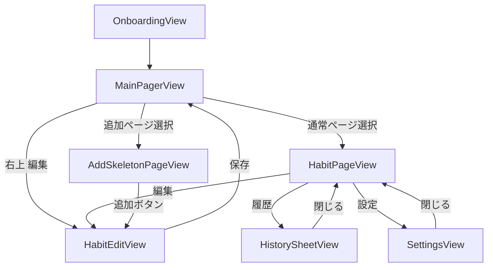

# Habit Pet 具体設計書（SQLiteData/GRDB 改訂版）

## 1. 設計方針

- 本設計は `ios-sqlitedata-app` パターンに準拠する。
- 永続化は Point-Free SQLiteData + GRDB を使用。
- **永続Entityは `Habit` と `HabitEvent` のみ**。`Character` は固定マスタ（アプリ内定数）として扱う。
- 書き込みは DataStore を唯一の入口にする。
- 画面イベントは ViewModel の `Void` メソッドで受ける。
- 悪化は即時、回復は遅延のUXルールを守る。

## 2. 永続データ設計

## 2.1 Entity一覧（永続）

1. `Habit`
2. `HabitEvent`

## 2.2 固定マスタ（非永続）

- `CharacterMaster`（enum/static配列）
  - 例: `hamster`, `rabbit`
  - 注意: `CharacterID` は動物種別のみを表す。苦しみ段階（Lv1..Lv5）は状態ロジックで別管理する。
  - Pro制御は StoreKit の判定結果で表示可否を切る（DB/`UserDefaults` キャッシュしない）。

## 2.3 `@Table` モデル

`enum` で表現可能な値はすべて `String` 準拠 enum を使う（永続化時は rawValue を保存）。

```swift
enum HabitMode: String { case smoking, alcohol, gambling }
enum CountUnit: String { case cigarettes, drinks, plays }
enum CountPolicy: String { case cumulative, dailyReset }
enum BaselineSource: String { case manual, auto }
enum GoalType: String { case none, streakDays, targetDate }
enum EventSource: String { case app, widget }
enum CharacterID: String { case hamster, rabbit }
```

```swift
@Table
struct Habit {
  let id: UUID
  var name: String                    // 例: 禁煙
  var mode: HabitMode
  var characterID: CharacterID
  var countUnit: CountUnit
  var countPolicy: CountPolicy
  var baselineSource: BaselineSource
  var baselineManualValue: Double?
  var goalType: GoalType
  var goalValue: Int?
  var goalDate: String?               // yyyy-MM-dd
  var isArchived: Bool
  var sortOrder: Int
  var createdAt: Date
  var updatedAt: Date
}

@Table
struct HabitEvent {
  let id: UUID
  var habitID: Habit.ID
  var delta: Int                      // +1 / -1 を許可
  var source: EventSource
  var occurredAt: Date
  var revokedAt: Date?                // Undo(pop)時に設定して除外
  var createdAt: Date
}
```

## 2.4 リレーション・制約

- `Habit (1) - (N) HabitEvent`
- Index: `habitID + occurredAt`
- Index: `habitID + revokedAt`
- `Habit.characterID` は `CharacterMaster` のIDと一致すること（アプリ層で検証）

## 3. `@Selection` 設計（派生データ）

永続テーブルを増やさず、以下は `@Selection` で算出する。

1. `ActiveHabitEventSelection`
- `revokedAt == nil` の event のみ対象

2. `HabitTodayUsageSelection`
- 今日の `sum(delta)` を算出

3. `HabitBaselineSelection`
- 過去7日の日次合計から重み付き平均を算出

4. `HabitStateSelection`
- `todayUsage / baseline` から Lv(1...5) と状態テキストを生成

5. `HabitRecentHistorySelection`
- 直近履歴表示用（revokedを除外）

## 4. 設定保存

`AppSetting` テーブルは作らない。`UserDefaults` を使用。

- `selectedHabitID: UUID?`
- `lastOpenedPageIndex: Int`
- `widgetInlineAdjustDraftByHabitID: [UUID: Int]`（必要な場合のみメモリ優先）

## 5. Undo（pop）仕様

## 5.1 方針

- Undoは「直近イベントを除外する」pop操作。
- 削除ではなく `HabitEvent.revokedAt` をセットして無効化する。
- 状態算出・履歴表示は `revokedAt == nil` のみ採用。

## 5.2 挙動

- `+` を1回押した場合: 1回までUndo可能
- `+` を2回押した場合: 1回または2回Undo可能
- 実装は `undoLast(count: Int)` で、最新の有効eventを `count` 件pop

```swift
protocol HabitEventDataStore {
  func create(habitID: Habit.ID, delta: Int, source: String, occurredAt: Date) throws -> HabitEvent
  func revokeLast(habitID: Habit.ID, count: Int, now: Date) throws -> Int
}
```

## 6. UseCase設計

1. `RecordHabitDeltaUseCase`
- event作成（`delta = +1` または `-1`）
- Widget/App共通で使用

2. `UndoHabitDeltaUseCase`
- `revokeLast(habitID:count:)` を実行

3. `ComputeHabitStateUseCase`
- `@Selection` で todayUsage/baseline/stateText を算出

4. `CheckProEntitlementUseCase`
- StoreKitで都度判定（キャッシュしない）

## 7. ViewModel設計

## 7.1 MainPagerViewModel

- `@ObservationIgnored @FetchAll(Habit.order(by: \.sortOrder)) var habits`
- `@ObservationIgnored @FetchOne(Habit.count()) var habitCount`
- 追加用の疑似ページを `habits.count + 1` で構成

public event methods:
- `func onAppear() -> Void`
- `func onPageChanged(_ index: Int) -> Void`
- `func onEditTapped() -> Void`
- `func onAddPageTapped() -> Void`

## 7.2 HabitPageViewModel

- `@ObservationIgnored @FetchOne(Habit.filter(id: ...)) var habit`
- `@ObservationIgnored @Fetch(HabitStateSelection(habitID: ...)) var state`
- `@ObservationIgnored @FetchAll(HabitRecentHistorySelection(habitID: ...)) var recentEvents`

public event methods:
- `func onPlusTapped(source: String) -> Void`
- `func onMinusTapped(source: String) -> Void`
- `func onUndoTapped(count: Int) -> Void`
- `func onEditHabitTapped() -> Void`

## 7.3 HabitEditViewModel（新規/更新統合）

public event methods:
- `func onAppearForCreate() -> Void`
- `func onAppearForEdit(habitID: Habit.ID) -> Void`
- `func onNameChanged(_ value: String) -> Void`
- `func onModeChanged(_ mode: HabitMode) -> Void`
- `func onCharacterChanged(_ characterID: String) -> Void`
- `func onBaselineChanged(_ value: Double?) -> Void`
- `func onSaveTapped() -> Void`       // create/update 自動判定
- `func onArchiveTapped() -> Void`    // edit時のみ

## 8. UI設計

## 8.1 画面一覧

1. `OnboardingView`
2. `MainPagerView`
3. `HabitPageView`
4. `HabitEditView`（追加/更新共通）
5. `HistorySheetView`
6. `SettingsView`
7. `WidgetHabitPetView`

## 8.2 主要変更点

- 右上ボタンは `+` ではなく `編集`。
- Pagerは `習慣ページ + 1ページ` で構成。
- 追加ページは `AddSkeletonPageView`（説明 + 追加ボタン）を表示。
- 追加・更新は同一の `HabitEditView` で処理。

## 8.3 画面遷移図



## 9. Widget UI仕様（改訂）

## 9.1 通常時

- 表示: `状態テキスト` + `+ボタン`

## 9.2 `+` 押下後（インライン調整モード）

- 状態テキストを非表示
- 表示: `今日の本数/杯数` + `-ボタン` + `+ボタン`
- ユーザーは連続で `+/-` 調整可能
- 確定操作後に通常表示へ戻す（またはタイムアウトで戻す）

## 9.3 Undo整合

- Widgetの `-` は `delta = -1` 記録ではなく、基本は `Undo(pop)` と同義で扱う。
- 連続`+`後に `-` を押した回数分だけ直近eventを除外可能。

## 10. マイグレーション方針

- 初回リリース前: `Create tables` を作り直し可。
- リリース後: 既存 migration を変更しない。
- 初期テーブルは `habit`, `habitEvent` のみ（`STRICT`）。

## 11. Pro制御（StoreKit）

- Pro判定は StoreKit API から取得。
- DBや `UserDefaults` に entitlement をキャッシュしない。
- 表示都度または起動時に再取得し、UIゲートへ反映する。

## 12. CharacterAppearance層

- `CharacterID`（動物種別）と `HabitState.level`（1..5）を入力に、表示用アセット名を決定する。
- 変換責務は `CharacterAppearanceResolver` に集約する。
- 命名規約: `character_<characterID>_lv<level>`
- アセット未追加時はフォールバック絵文字を表示し、UIを壊さない。
- 画像追加手順は [character-assets.md](/Users/matsushitakazuya/private/HabitPet/docs/character-assets.md) を参照。
